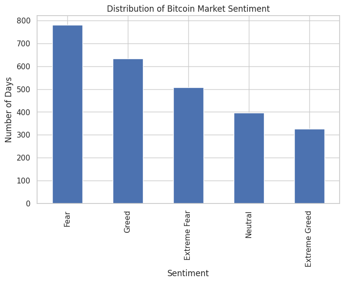
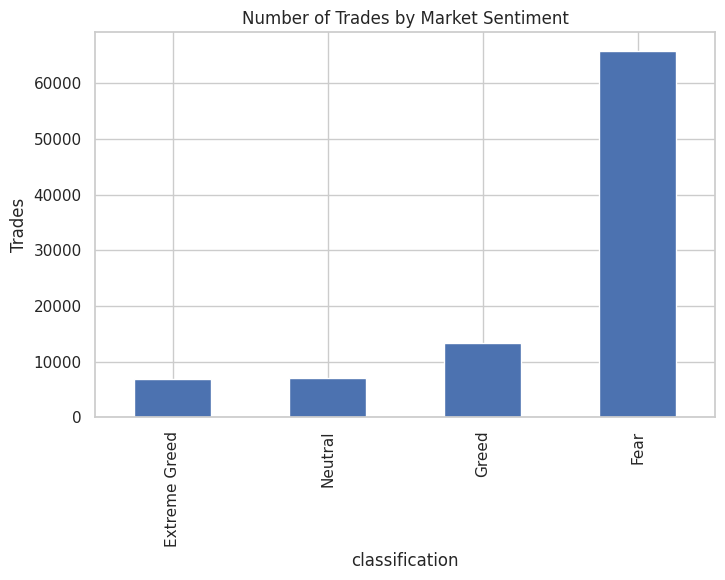
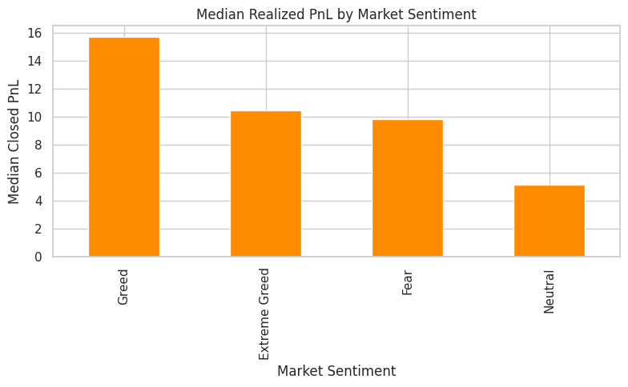
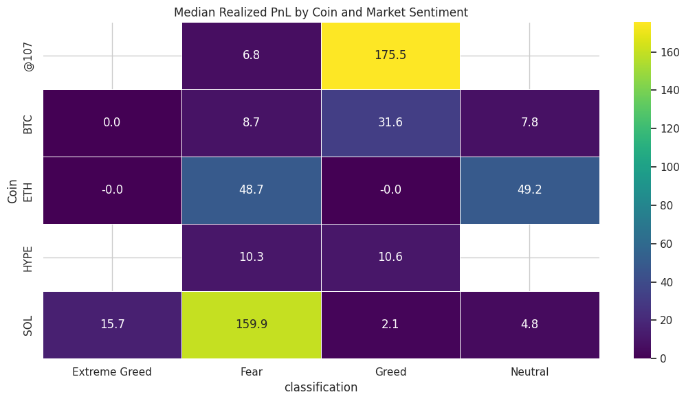
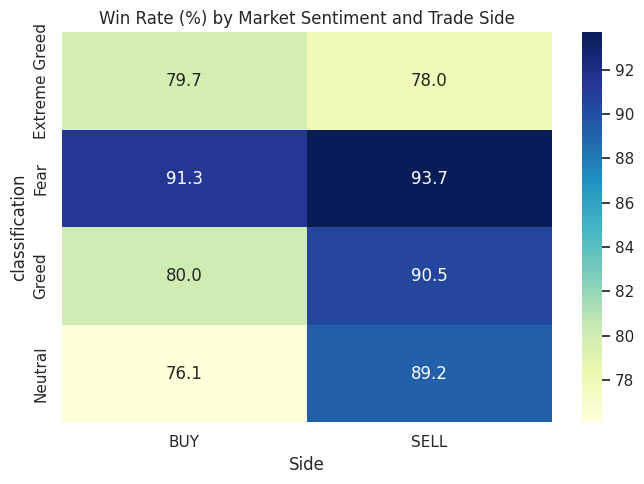

# 📈 Bitcoin Market Sentiment & Trader Performance Analysis

> An end-to-end data analysis project exploring how Bitcoin market sentiment influences trader behavior and profitability using the Bitcoin Fear & Greed Index and Hyperliquid historical trading data.


---

# 📌 Project Overview

This project investigates the relationship between **Bitcoin market sentiment** and **trader performance** by combining the **Bitcoin Fear & Greed Index** with **107,259 historical Hyperliquid trades**.

The objective is to determine whether market sentiment influences:

- 📈 Trading Activity
- 💰 Profitability
- 🎯 Win Rate
- 🔄 Buy vs Sell Performance
- 🪙 Coin-wise Performance

The project concludes with actionable trading insights and recommendations supported by visualizations and statistical analysis.

---

# 🚀 Highlights

- 📊 Analyzed **107,259 historical trades**
- 📅 Merged trading data with the **Bitcoin Fear & Greed Index**
- 📈 Built **10+ analytical visualizations**
- 📉 Evaluated profitability, win rate, and trade direction
- 📝 Produced a detailed analytical report with business recommendations

---

# 📂 Dataset

## Bitcoin Fear & Greed Index

Daily market sentiment classified into:

- Fear
- Greed
- Neutral
- Extreme Greed

---

## Hyperliquid Historical Trading Dataset

Contains over **107,000 historical trades** including:

- Account
- Coin
- Execution Price
- Size (USD)
- Trade Side
- Closed PnL
- Fee
- Timestamp

---

# 🛠 Tech Stack

- Python
- Pandas
- NumPy
- Matplotlib
- Seaborn
- SciPy
- Jupyter Notebook

---

# 🔄 Project Workflow

```text
Data Collection
      │
      ▼
Data Cleaning
      │
      ▼
Feature Engineering
      │
      ▼
Dataset Merging
      │
      ▼
Exploratory Data Analysis
      │
      ▼
Trader Performance Analysis
      │
      ▼
Advanced Sentiment Analysis
      │
      ▼
Business Insights & Recommendations
```

---

# 📊 Key Visualizations

## Distribution of Bitcoin Market Sentiment



---

## Number of Trades by Market Sentiment



---

## Median Realized PnL by Market Sentiment



---

## Coin × Market Sentiment Heatmap



---

## Win Rate by Market Sentiment and Trade Side



---

# 📈 Analysis Performed

### Market Overview

- Distribution of Market Sentiment
- Trading Activity Analysis
- Top Traded Cryptocurrencies

### Trader Performance

- Average Realized PnL
- Median Realized PnL
- Win Rate Analysis
- Profit Distribution

### Advanced Analysis

- Coin-wise Profitability
- Buy vs Sell Performance
- Sentiment Heatmaps
- Trade Direction Analysis

---

# 🔍 Key Findings

### 📌 Fear markets generated the highest trading activity.

Periods of market uncertainty resulted in substantially higher trading participation than Greed or Neutral markets.

---

### 📌 Greed markets produced the highest realized profitability.

Both average and median realized PnL peaked during Greed periods, indicating stronger profit opportunities.

---

### 📌 Fear markets achieved the highest win rate.

Although profits were larger during Greed, Fear markets produced more consistent winning trades.

---

### 📌 Trade direction depends on market sentiment.

BUY trades performed best during Fear, while SELL trades generally outperformed during Greed and Neutral markets.

---

### 📌 Trading activity was highly concentrated.

Most trading volume came from **HYPE** and **BTC**, making them the primary drivers of portfolio performance.

---

# 💡 Business Recommendations

- Integrate the Bitcoin Fear & Greed Index into trading decision-making.
- Increase risk management during Fear markets due to higher trading activity.
- Favor trend-following strategies during Greed markets.
- Develop coin-specific trading strategies.
- Adapt BUY and SELL decisions according to prevailing market sentiment.

---

# 📁 Repository Structure

```text
Bitcoin-Market-Sentiment-Analysis/
│
├── README.md
├── requirements.txt
├── Bitcoin_Market_Sentiment_Analysis.ipynb
│
├── data/
│   ├── historical_data.csv
│   └── fear_greed_index.csv
│
├── screenshots/
│   ├── 01_sentiment_distribution.png
│   ├── 02_trades_by_sentiment.png
│   ├── 03_trading_by_weekday
│   ├── 04_top_15_coins.png
    ├── 05_avg_pnl_by_sentiment.png
    ├── 06_median_pnl_by_sentiment.png
    ├── 07_win_rate_by_sentiment.png
    ├── 08_profit_distribution_full.png
    ├── 09_profit_distribution_trimmed.png
    ├── 10_median_pnl_coin_heatmap.png
    ├── 11_avg_pnl_by_side.png
    ├── 12_median_pnl_by_side.png
    ├── 13_win_rate_by_side.png
│   └── 14_win_rate_heatmap.png
│
└── report/
    └── Bitcoin_Market_Sentiment_Trading_Report.pdf
```

---

# ⚙ Installation

Clone the repository

```bash
git clone https://github.com/RohanVr04/Bitcoin-Market-Sentiment-Analysis.git
```

Move into the project directory

```bash
cd Bitcoin-Market-Sentiment-Analysis
```

Install dependencies

```bash
pip install -r requirements.txt
```

Launch Jupyter Notebook

```bash
jupyter notebook
```

---

# 📄 Report

A comprehensive report containing detailed analysis, visualizations, business insights, and recommendations is available in:

```text
report/Bitcoin_Market_Sentiment_Trading_Report.pdf
```

---

# ⚠ Limitations

- Around 52% of trade executions reported zero realized PnL and were excluded from profitability analysis.
- Some coin–sentiment combinations had relatively few observations and should be interpreted cautiously.
- Time-based trading analysis was limited due to timestamp characteristics in the exported dataset.

---

# 👨‍💻 Author

**Rohan Verma**

- GitHub: https://github.com/RohanVr04

---

## ⭐ If you found this project useful, consider giving it a star!
